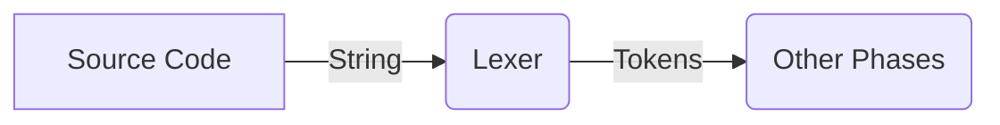
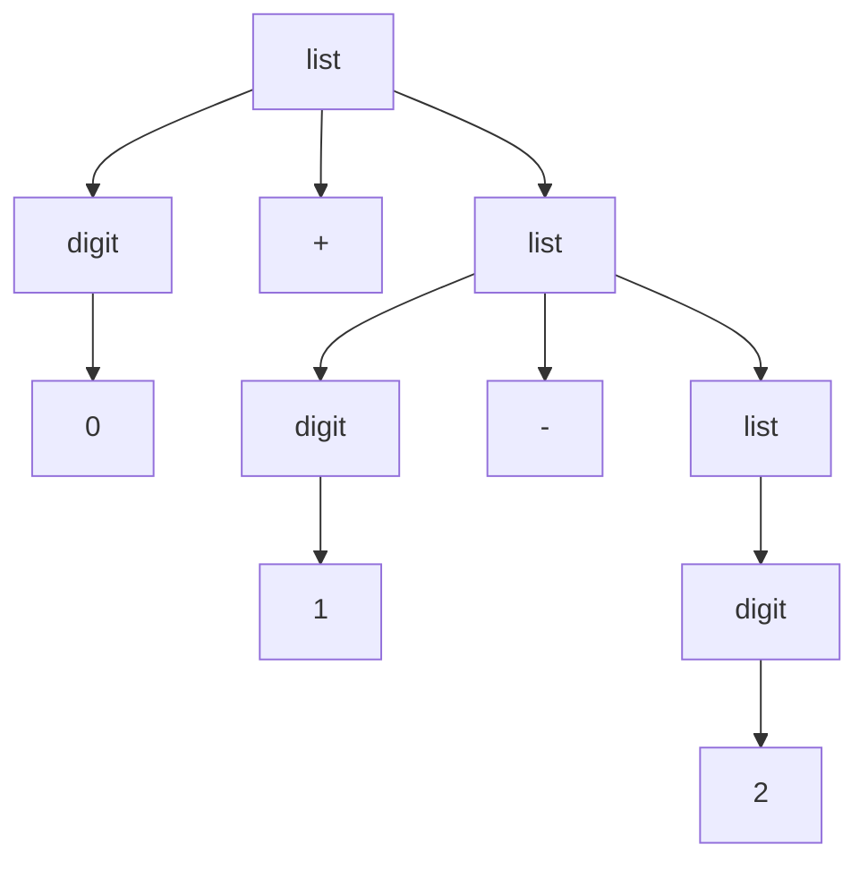

## Lexical Analysis Phase of the Compiler



> Token:- Group of Characters having some meaning

> Lexeme:- Group of Characters from source code that matches matching rule of any token.

> Matching Rule:- An specification by which we can tell if a string can be a token.

| Token | Lexemes | Rule |
| ----- | ----- | ----- |
| const | const | const |
| relation | <,<=,=,>,=> | < | <= | = | > | =>|
| id  | pi, count, D2 | (letter.(letter | digit)*)
| num  | 3, 3.232 | any const number

But saying what token a lexeme belongs to is not enough, we also have to provide extra attribute. *pi*, *count* both are identifiers, downstream
phases must also know the name of the identifiers. Example
`pi -> <identifier_token, 'pi'>`
### How to specify a rule? (CFG)

#### What is a CFG(Context Free Grammars)?

1. A set of terminal symbols.
2. A set of non-terminals.
3. A set of productions, of the format non-terminal -> non-terminal or terminal

Example:-

```python
list -> list + digit
list -> list - digit
list -> digit
digit -> 0|1|2
# 0 and 1 are terminals
```

Now we can verify that a string `0 + 1 - 2` belongs to the language generated by the above grammar.

##### Parse Tree
Parse Tree can be used to show a string can be generated from the grammar


Same string can have multiple parse trees. Such grammars are called ambiguous.

