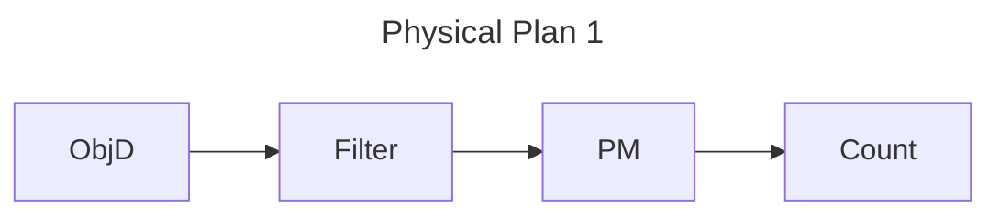
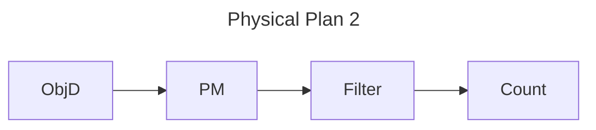

## Intro

Given an analytics query, containing ML operators, we want to minimize latency/cost.

### Examples:-

#### Query-1. Distinct Pedestrian in Traffic Camera(DeepLens: q4)

Given stream of frames, containing pedestrian we want to count distinct pedestrian.

##### Models Required

1. Object Bbox Detector. Given an image extracts object bbox. We will refer to this as ObjD.
2. Pedestrian Matcher. Given two bbox, say if they are same person. We will refer to this as PM

##### The Physical plan

<u>Non Primitive Data Structures:-</u>

1. Frame:- struct { data, frame_id }
2. Bbox:- struct { data, frame_id, label=None }

<u> Operators </u>

1. ObjD takes `(frame)` produces `([bbox])`.
2. Filter takes `([bbox])` produces `([bbox])` such that any bbox.label == 'Human'.
3. Match takes `(bbox)` produces `(bool, bbox, bbox)`. Return `(True, bbox, bbox2)` if bbox.patch matches bbox2.patch, else return `(False, bbox, bbox)`.
Note that it is stateful, it stores all the previous bboxes.
4. Count takes `(bool)` produces `(int)`. Increases count by 1 if receives input is False. This operator is also stateful.

