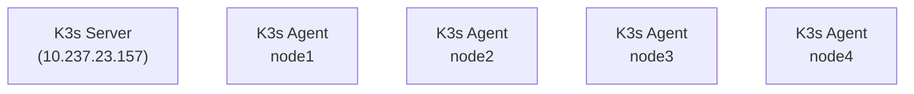

---
date:
  created: 2025-04-17
categories:
  - dev-diary
tags:
  - rust
comments: true
---

#  Setting up K3s cluster
<!-- more -->

Creating this diary entry for future reference, on how I setup the K3s cluster in our cloud lab.
This setup might be too specific for my current needs of Tensile Project. Final setup:-




1. Start K3s Server on `10.237.23.157` of the machines:- `curl -sfL https://get.k3s.io | sh -c`
2. Start K3s Agent on rest of the machines:- `curl -sfL https://get.k3s.io | K3S_URL=https://10.237.23.157:6443 K3S_TOKEN= sh -`.
TOKEN can be found in `/var/lib/rancher/k3s/server/node-token` on the server.
3. See the connected nodes on the server:- `sudo kubectl get nodes`
4. Copy the `/etc/rancher/k3s/k3s.yaml` to `~/.kube/config`

## Setting up Minio on K3s cluster.
1. Install **helm**.
2. Add minio-operator repo to helm: `helm repo add minio-operator https://operator.min.io`
3. Verify `helm search repo minio-operator`
4. Install minio operator.
```
helm install \
  --namespace minio-operator \
  --create-namespace \
  --set replicaCount=4 \
  operator minio-operator/operator
```
5. Install minio tenant
```
  helm install --namespace tensile_ckpt \
  --create-namespace \
  --set tenant.name=tensile \
  --set tenant.pools.server=4 \
  tensile_minio minio-operator/tenant
```
6. Verify:- Forward the UI consile port using:-
```
  kubectl port-forward --address 0.0.0.0  svc/tensile-console 9443 -n tensile-ckpt
```
Access:- https://0.0.0.0:9443/


## Setting up Harbor on K3s cluster.
1. Install **helm**.
2. Add goharbor repo to helm: `helm repo add harbor https://helm.goharbor.io`
3. Install the chart.
```
  helm install harbor . -n registry \
  --set export.type=nodePort \
  --set externalURL=http://10.237.x.x:30002 
```
4. Access the portal on http://10.237.x.x:30002. Default username password is admin, Harbor123345
5. On the nodes where the registry is to be used:-
    1. Add `"{insecure-registries": ["10.237.x.x:30002"]}` in /etc/docker/daemon.json
    2. `sudo systemctl restart docker`
    3. `docker login http://10.237.23.157:30002`. User can be created throguh the portal
    4. `docker tag docker tag hello-world:latest 10.237.x.x:30002/project_name/hello-world:latest`
    5. `docker push  10.237.x.x:30002/tensile/hello-world:latest`
