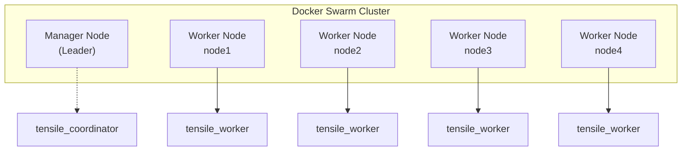

---
date:
  created: 2025-04-17
categories:
  - dev-diary
tags:
  - rust
comments: true
---

#  Setting up Docker Swarm
<!-- more -->

Creating this diary entry for future reference, on how to setup the docker swarm.
This setup might be too specific for my current needs of Tensile Project. Setup I want to achieve:-



## Prerequisites
1. Docker is installed on all the host machines that is going to be part of the cluster.
2. All host machines are able to connect to each other and Port `2377`, `7946` and `4789` are open.
3. I also made sure all of them have the same version of docker engine. I dont
know if this is required or not

## Steps to initialize the Swarm.
1. On the Manager node, initialize the swarm using: `docker swarm init --advertise-addr <MANAGER-IP>`
2. Make the worker nodes join the swarm using
`docker swarm join --token <TOKEN> <MANAGER_ID>:2377`. You will get the token
when you initialized the swarm on the manager node.
3. Check if the nodes have joined the cluster using `docker node ls`.
For example it outputs following in my case.

| ID                            | HOSTNAME             | STATUS | AVAILABILITY | MANAGER STATUS | ENGINE VERSION |
|------------------------------|-----------------------|--------|--------------|----------------|----------------|
| o9hyne818eeig834qe32arhy8 *  | dell-OptiPlex-3060    | Ready  | Active       | Leader         | 28.0.4         |
| xxurgpcq11twzfyrf5epf3yro    | node1                 | Ready  | Active       |                | 28.0.4         |
| ggvty0hj0j3f32dbe3rqzw8k5    | node2                 | Ready  | Active       |                | 28.0.4         |
| 8dfwhodu6qgt4igbqu8v4uv0a    | node3                 | Ready  | Active       |                | 28.0.4         |
| ibc0jo9o849ae1sy1ypld7rk6    | node4                 | Ready  | Active       |                | 28.0.4         |

## Steps to start the service.
Now I want to start a single Tensile Worker service on each node (4 in total). I have already built
the image of the Tensile worker.

1. First label the node1, node2, node3 and node4 with the role of tensile worker.
This is required because we dont want to spwan a worker on the manager node. Run this on the manager node.
`docker node update --label-add role=tensie_worker node1`

2. Now I start the service using following. Note that we also spawn them in a global mode, because we
only want one instance per node. Also we are using a local docker registry hosted on `10.237.23.157`.
`--publish mode=host` will publish the given port on each node, i.e. you can access port 6000 on
each node individually.

```bash
docker service create \
  --name tensile_worker \
  --mode global \
  --constraint 'node.labels.role == tensile_worker' \
  --restart-condition any \
  --env DATABASE_URL="blahblah" \
  --publish mode=host,target=6000,published=6000 \
  10.237.23.157:5000/tensile-worker:latest
```
