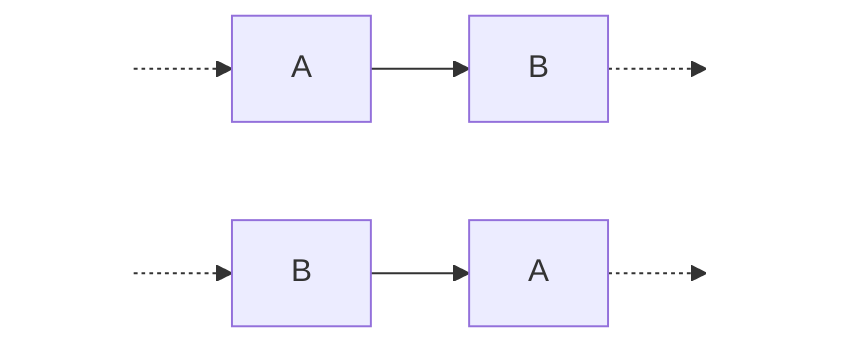
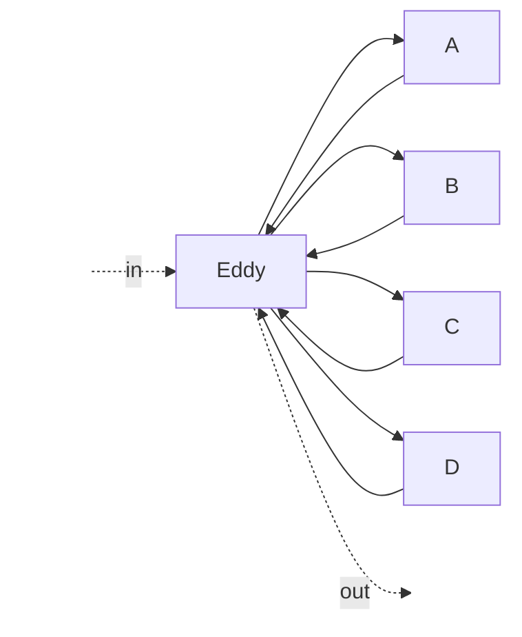

---
date:
  created: 2025-02-21
categories:
  - research-diary
  - paper
draft: true
---

# Thoughts on optimization in streaming systems
<!-- more -->
## Can I build something similar to Volcano for streaming systems?

Advantages:-

1. Unifies research efforts of a decade into a single system.
2. Allows reuseability of existing approaches.
3. Allows uniform interface for optimization writers.
4. Allows us to observe the interplay of different optimizations with one another.

Challenges:-

1. Static optimization is not enough for standing queries. Runtime optimizations
must be a first class citizen.
2. To allow frequent reconfigurations, the hit in TP/latency should be minimal due to the said
 reconfiguration.
3. How to capture operator semantics? Is CQL enough?
4. Figure out what kinds of metric should be made availble by the streaming runtime to the
optimization engine for it to make optimization decision.
5. What changes we will have to make in our own streaming system (Tensile)?

## Background
I will write my own thoughts on different optimizations discussed in this
[paper](https://dl.acm.org/doi/10.1145/2528412&ved=2ahUKEwjah735p9SLAxWGUGcHHQULB3YQFnoECAkQAQ&usg=AOvVaw0gGGaDPNadjWWoOtSx2nqr).

1. Operator reordering:-
Idea:- Put the more selective operator earlier in the chain.

At compile time, we might or might not have the selectivity of all the operator, and even if we do
it might change at runtime.

Existing approach:- [Eddy](https://dl.acm.org/doi/10.1145/342009.335420).

In this approach an eddy operator is connected to every other operator and based on the probability
distribution that it maintains and updates, it routes the messages.
This obviously comes with extra overhead for routing, also in cases where A and B are on same
machine and eddy is on some other machine, we cannot take advantage of the locality and incur
network cost.

We might not need this if the reconfiguration is fast enough (which it is in Tensile).
